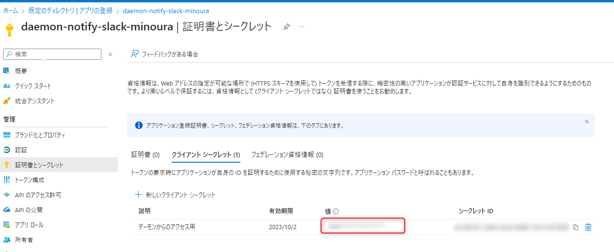
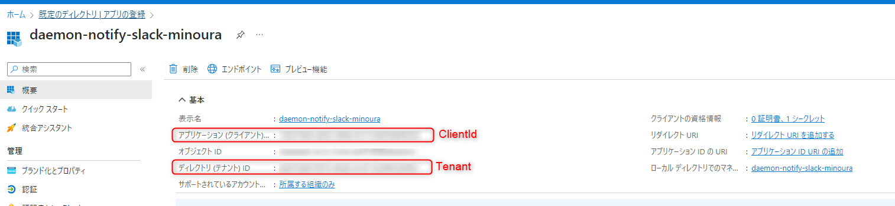
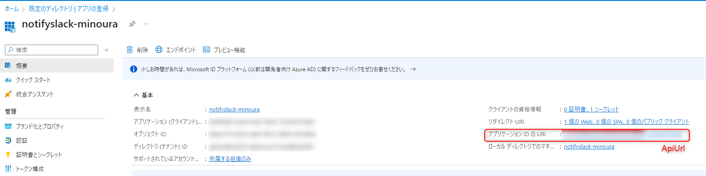

# Notify Slack of web meeting

[](https://github.com/yamadakou/notify-slack-of-web-meeting/workflows/build.yml)

当日の Web 会議の情報を Slack に通知するWeb サービスです。

## 概要

### Notify Slack of web meeting の特徴

* テレワークが増え会議も Web 会議が主流となり、毎日、Web 会議の URL を Outlook から参照する手間が増えました。
* そこで、今日、予定されている Web 会議を毎朝 Slack で確認できるよう、本サービスでは以下の機能を提供します。
  * システムを利用できるユーザーの管理
  * Web会議情報を登録・検索・削除する REST API
  * 通知先のSlackチャンネル情報を登録・検索・削除する REST API
  * 朝9時に当日のWeb会議情報を指定の Slack チャンネルに通知する定期バッチ
* システムを利用できるユーザーを管理するためのWebアプリを下記リポジトリで提供しており、システムを構築する代表者がシステムを利用できるユーザーを登録し、複数ユーザーにまとめて利用してもらうことができます。
Notify Slack of web meeting Admin
https://github.com/tsuzukita/NotifySlackOfWebMeetingAdmin
* Web会議情報や通知先の Slack チャンネル情報の登録などは自由にクライアントを用意することで、 Outlook や Google カレンダーなど好みの予定表から Web 会議情報を抽出し、指定した Slack チャンネルに通知することが可能です。
  * Outlook クライアントからログインユーザーの翌日の Web 会議情報を登録するコンソールアプリは下記リポジトリで提供しており、 Windows タスクスケジューラで毎日実行するよう登録することで、自動的に毎朝9時に当日の Web 会議情報を Slack で確認できます。
    * [Notify Slack of web meeting CLI](https://github.com/yamadakou/notify-slack-of-web-meeting.cli)
      * https://github.com/yamadakou/notify-slack-of-web-meeting.cli

### システム全体構成


### 機能説明

#### REST APIの呼び出しに必要なヘッダ設定
REST APIの呼び出しには以下のヘッダ情報が必要です。
|ヘッダ名|説明|
|:--|:--|
|x-nsw-email-address|Eメールアドレス※1|
|x-nsw-auth-key|認可キー※2|

※1は利用者管理アプリに登録したユーザーのEメールアドレスです。  
※2は利用者管理アプリでユーザー登録後に取得できる認可トークン列の値です。

####  Web会議情報を登録・検索・削除する REST API
* Web会議情報を登録
  ```js
  POST api/WebMeetings
  {
      "name": <Web会議名>,
      "startDateTime": <翌日以降のWeb会議の開始日時>,
      "url": <Web会議のURL>,
      "registeredBy": <登録者>,
      "slackChannelId": <通知先のSlackチャンネル情報のID>
  }
  ```
  * 全ての項目が必須項目となります。
  * `startDateTime` は翌日以降の日時を指定する必要があります。

  * レスポンス(登録したWeb会議情報を返す)
    ```json
    {
      "id": <Web会議情報ID>,
      "name": <Web会議名>,
      "startDateTime": <Web会議の開始日時>,
      "date": <Web会議の日付(UNIXエポックタイム)>,
      "url": <Web会議のURL>,
      "registeredBy": <登録者>,
      "registeredAt": <登録日時>,
      "slackChannelId": <通知先のSlackチャンネル情報のID>
    }
    ```

* Web会議情報を検索
  ```js
  GET api/WebMeetings
  ```
  * クエリパラメータ
  
    |項目|値|備考|
    |:--|:--|:--|
    |ids|Web会議情報ID|複数指定時はカンマ区切りで指定|
    |fromDate|Web会議の日付範囲の開始日（ISO8601形式の文字列）|Web会議の開始日と終了日を指定する場合、終了日を含む過去日を指定
    |toDate|Web会議の日付範囲の終了日（ISO8601形式の文字列）|Web会議の開始日と終了日を指定する場合、開始日を含む未来日を指定
    |registeredBy|登録者|完全一致
    |slackChannelId|通知先のSlackチャンネル情報ID|

  * レスポンス
    ```json
    [{
      "id": <Web会議情報ID>,
      "name": <Web会議名>,
      "startDateTime": <Web会議の開始日時>,
      "date": <Web会議の日付(UNIXエポックタイム)>,
      "url": <Web会議のURL>,
      "registeredBy": <登録者>,
      "registeredAt": <登録日時>,
      "slackChannelId": <通知先のSlackチャンネル情報のID>
    }]
    ```

* Web会議情報を取得
  ```js
  GET api/WebMeetings/{Web会議情報ID(複数指定時はカンマ区切りで指定)}
  ```

  * レスポンス
    ```json
    [{
      "id": <Web会議情報ID>,
      "name": <Web会議名>,
      "startDateTime": <Web会議の開始日時>,
      "date": <Web会議の日付(UNIXエポックタイム)>,
      "url": <Web会議のURL>,
      "registeredBy": <登録者>,
      "registeredAt": <登録日時>,
      "slackChannelId": <通知先のSlackチャンネル情報のID>
    }]
    ```

* Web会議情報を削除
  ```js
  DELETE api/WebMeetings/{Web会議情報ID(複数指定時はカンマ区切りで指定)}
  ```

  * レスポンス(削除したWeb会議情報を返す)
    ```json
    [{
      "id": <Web会議情報ID>,
      "name": <Web会議名>,
      "startDateTime": <Web会議の開始日時>,
      "date": <Web会議の日付(UNIXエポックタイム)>,
      "url": <Web会議のURL>,
      "registeredBy": <登録者>,
      "registeredAt": <登録日時>,
      "slackChannelId": <通知先のSlackチャンネル情報のID>
    }]
    ```

####  通知先のSlackチャンネル情報を登録・検索・削除する REST API
* Slackチャンネル情報を登録
  ```js
  POST api/SlackChannels
  {
      "name": <Slackチャンネル情報名>,
      "webhookUrl": <SlackチャンネルのWebhook URL>,
      "registeredBy": <登録者>
  }
  ```
  * 全ての項目が必須項目となります。

  * レスポンス(登録したSlackチャンネル情報を返す)
    ```json
    {
      "id": <Slackチャンネル情報ID>,
      "name": <Slackチャンネル情報名>,
      "webhookUrl": <SlackチャンネルのWebhook URL>,
      "registeredBy": <登録者>,
      "registeredAt": <登録日時>
    }
    ```

* Slackチャンネル情報を検索
  ```js
  GET api/SlackChannels
  ```
  * クエリパラメータ
  
    |項目|値|備考|
    |:--|:--|:--|
    |ids|Slackチャンネル情報ID|複数指定時はカンマ区切りで指定|
    |name|Slackチャンネル情報名|部分一致
    |webhookUrl|SlackチャンネルのWebhook URL|完全一致
    |registeredBy|登録者|完全一致

  * レスポンス
    ```json
    [{
      "id": <Slackチャンネル情報ID>,
      "name": <Slackチャンネル情報名>,
      "webhookUrl": <SlackチャンネルのWebhook URL>,
      "registeredBy": <登録者>,
      "registeredAt": <登録日時>
    }]
    ```

* Slackチャンネル情報を取得
  ```js
  GET api/SlackChannels/{Slackチャンネル情報ID(単一指定)}
  ```

  * レスポンス
    ```json
    {
      "id": <Slackチャンネル情報ID>,
      "name": <Slackチャンネル情報名>,
      "webhookUrl": <SlackチャンネルのWebhook URL>,
      "registeredBy": <登録者>,
      "registeredAt": <登録日時>
    }
    ```

* Slackチャンネル情報を削除
  ```js
  DELETE api/SlackChannels/{Slackチャンネル情報ID(複数指定時はカンマ区切りで指定)}
  ```

  * レスポンス(削除したSlackチャンネル情報を返す)
    ```json
    [{
      "id": <Slackチャンネル情報ID>,
      "name": <Slackチャンネル情報名>,
      "webhookUrl": <SlackチャンネルのWebhook URL>,
      "registeredBy": <登録者>,
      "registeredAt": <登録日時>
    }]
    ```
#### 当日のWeb会議情報を指定の Slack チャンネルに通知する定期バッチ
* 平日の朝9時に実行
* 翌日のWeb会議情報をWeb会議情報に指定されているSlackチャンネル情報ごとに開始時刻順にソートし、Slackチャンネルに通知します。
* Slackチャンネルに通知したWeb会議情報は削除します。

## 利用方法

### Azure環境

Azure Functions と Azure Cosmos DB を利用します。
* Azure Cosmos DB アカウントに以下の Database および Container を作成する。
  * Database
    * Name: notify-slack-of-web-meeting-db
  * Container
    * Web会議情報
      * Name: WebMeetings
      * Partition key: /date
    * Slackチャンネル情報
      * Name: SlackChannels
      * Partition key: /id
#### 参考
  * クイック スタート:Azure portal を使用して Azure Cosmos のアカウント、データベース、コンテナー、および項目を作成する
    * https://docs.microsoft.com/ja-jp/azure/cosmos-db/sql/create-cosmosdb-resources-portal
  * Azure Cosmos DB の Free レベル
    * https://docs.microsoft.com/ja-jp/azure/cosmos-db/free-tier

### ビルド環境
Visual Studio Code で、ビルドと Azure Functions への発行ができるよう、以下の環境を整える。
  * .NET Core 3.1 SDK
    * https://dotnet.microsoft.com/en-us/download/dotnet/3.1
  * Azure Functions Core Tools バージョン 3.x
    * https://docs.microsoft.com/ja-jp/azure/azure-functions/functions-run-local?tabs=v3%2Cwindows%2Ccsharp%2Cportal%2Cbash#install-the-azure-functions-core-tools
  * Visual Studio Code
    * https://code.visualstudio.com/
  * Visual Studio Code 用の C# 拡張機能
    * https://marketplace.visualstudio.com/items?itemName=ms-dotnettools.csharp
  * Visual Studio Code 用 Azure Functions 拡張機能
    * https://marketplace.visualstudio.com/items?itemName=ms-azuretools.vscode-azurefunctions
  * Visual Studio Code 用の Azure データベース拡張機能
    * https://marketplace.visualstudio.com/items?itemName=ms-azuretools.vscode-cosmosdb

#### 参考
  * Visual Studio Code を使用して Azure Functions を開発する
    * https://docs.microsoft.com/ja-jp/azure/azure-functions/create-first-function-vs-code-csharp?tabs=in-process

### ビルド＆デプロイ
1. 本システムを利用するユーザーを登録する
    * 利用者管理アプリでユーザーを登録する
    * 詳細は以下のリポジトリを参照
    * https://github.com/yamadakou/Notify-Slack-of-web-meetings-Admin
2. `gir clone ・・・` などで本プロジェクトをローカルに取得し、 Visual Studio Code で開く。
3. ビルドできるよう、[依存パッケージ](依存パッケージ)を .NET CLI のコマンド `dotnet add package ・・・` で導入する。
4. `dotnet build` で、ビルドが成功することを確認する。
5. 以下の Microsoft Docs を参考に、Azure Cosmos DB への接続情報をアプリの設定に追加する。
    * 関数アプリの設定を更新する
      * https://docs.microsoft.com/ja-jp/azure/azure-functions/functions-add-output-binding-cosmos-db-vs-code?pivots=programming-language-csharp&tabs=in-process#update-your-function-app-settings
6. 以下の Microsoft Docs を参考に、Azure にプロジェクトを発行（デプロイ）する。
    * Azure にプロジェクトを発行する
      * https://docs.microsoft.com/ja-jp/azure/azure-functions/create-first-function-vs-code-csharp?tabs=in-process#publish-the-project-to-azure
7. 日本時間で動作させるために Azure Functions のアプリケーション設定に以下を追加する。
    |名前|値|
    |:--|:--|
    |WEBSITE_TIME_ZONE|Tokyo Standard Time|
    * 参考
      * https://docs.microsoft.com/ja-jp/azure/azure-functions/functions-bindings-timer?tabs=csharp#ncrontab-time-zones
8.  認証の設定を有効にするために、Azure Functionsで認証を要求する設定を行う
    * Azure PotalでデプロイしたAzure Functionsを開く
    * 左のナビの[設定] - [認証]を開き、IDプロバイダーを追加する
    * IDプロバイダーの選択で[Microsoft]を選択する
    * 認証されていない要求の設定で、[HTTP 401 認可されていない: API に推奨]を選択する
    * 他はデフォルト設定とし、[追加]ボタンを押下する
    * Azure Potalの、[Azure Avtive Directory]を開く
    * 左のナビの[管理] - [アプリの登録]を開きAzure Functionsの名前でアプリが登録されているため、開く
    * 左のナビの[管理] - [アプリのロール]を開き、[アプリロールの作成]を押下する
    * 表示名、値、説明に「ReadWrite」と記入（表示名と説明は任意）し、許可されたメンバーの種類は「両方」を選択し、[適用]ボタンを押下する
9.  認証が必要なAzure Functionsにアクセスするためにデーモンアプリを作成する
    * Azure Potalの、[Azure Avtive Directory]を開く
    * 左のナビの[管理] - [アプリの登録]を開き、新規追加を押下する
    * 名前にdaemon-{Azure Functionsの名前}のように対象のAzure Functionsのデーモンアプリであることがわかる名前を入力する
    * 他はデフォルト設定とし、[登録]ボタンを押下する
    * 作成したデーモンアプリを開き、左のナビの[管理] - [証明書とシークレット]を押下する。
    * [新しいクライアントシークレット]を押下し、説明欄には「デーモンからのアクセス用」など用途がわかる説明を入れ、他はデフォルト設定とし、[追加]ボタンを押下する。
    * シークレットの追加後に表示されるシークレットの値は10の手順で必要であるため、控えておく
    
    * 左のナビの[管理] - [APIのアクセス許可]を押下し、[アクセス許可の追加]を押下する
    * [自分のAPI]タブを開き、7で作成したアプリを選択し、[アプリケーションの許可]を押下し、7で作成したロール（ReadWrite）にチェックを付ける
    * [アクセス許可の追加]を押下する
    * 元の[APIのアクセス許可]のページに戻り、7で追加したアプリが増えていることを確認する
    * [既定のディレクトリに管理者の同意を与えます]を押下する
10. スケジュール登録アプリを動作させるために必要な設定ファイルを作成
    * 以下の設定値を記載したJSON形式のファイルを作成する。ファイル名は`appsettings.json`とする。作成したファイルは手順11で使用する。
    ```
    {
        "Instance": "https://login.microsoftonline.com/{0}",
        "Tenant": "{デーモンアプリのテナントID}",
        "ClientId": "{デーモンアプリのクライアントID}",
        "ClientSecret": "{デーモンアプリのシークレット}",
        "ApiUrl": "{ファンクションアプリのアプリケーション ID の URI}/"
    }
    ```
    設定値ごとの取得方法は以下の通りである。  
    * Tenant, ClientId  
      * Azure Potalの[Azure Avtive Directory]を開く
      * 左のナビの[管理] - [アプリの登録]を選択し、手順9で作成したデーモンアプリを開く
      * 設定値は以下の通り
      
    * ClientSecret
      * 手順9で控えておいたシークレットの値
    * ApiUrl
      * Azure Potalの[Azure Avtive Directory]を開く
      * 左のナビの[管理] - [アプリの登録]を選択し、手順8で作成したアプリを開く
      * 設定値は以下の通り（__末尾に"/"を付けることを忘れないよう注意__）
      

11. クライアントからSlackチャンネル情報やWeb会議情報を登録する。
    * スケジュール登録アプリを利用して登録する
    * 詳細は以下のリポジトリを参照
      * https://github.com/yamadakou/notify-slack-of-web-meeting.cli

    
#### 依存パッケージ
※ `dotnet list package` の結果から作成
  |最上位レベル パッケージ|バージョン|Nuget|
  |:--|:--|:--|
  | FluentValidation                                 |10.3.4|https://www.nuget.org/packages/FluentValidation/10.3.4|
  | LinqKit.Microsoft.EntityFrameworkCore            |3.1.27|https://www.nuget.org/packages/LinqKit.Microsoft.EntityFrameworkCore/3.1.27|
  | Microsoft.Azure.Functions.Extensions             |1.1.0 |https://www.nuget.org/packages/Microsoft.Azure.Functions.Extensions/1.1.0|
  | Microsoft.Azure.WebJobs.Extensions.CosmosDB      |3.0.10|https://www.nuget.org/packages/Microsoft.Azure.WebJobs.Extensions.CosmosDB/3.0.10|
  | Microsoft.Extensions.DependencyInjection         |3.1.22|https://www.nuget.org/packages/Microsoft.Extensions.DependencyInjection/3.1.22|
  | Microsoft.Extensions.Http                        |3.1.22|https://www.nuget.org/packages/Microsoft.Extensions.Http/3.1.22|
  | Microsoft.Extensions.Http.Polly                  |3.1.22|https://www.nuget.org/packages/Microsoft.Extensions.Http.Polly/3.1.22|
  | Microsoft.NET.Sdk.Functions                      |3.0.13|https://www.nuget.org/packages/Microsoft.NET.Sdk.Functions/3.0.13|
  | SourceLink.Copy.PdbFiles                         |2.8.3 |https://www.nuget.org/packages/SourceLink.Copy.PdbFiles/2.8.3|


## （関連リポジトリ）
* Notify Slack of web meeting CLI
  * https://github.com/yamadakou/notify-slack-of-web-meeting.cli
* Notify Slack of web meetings Admin
  * https://github.com/yamadakou/Notify-Slack-of-web-meetings-Admin
